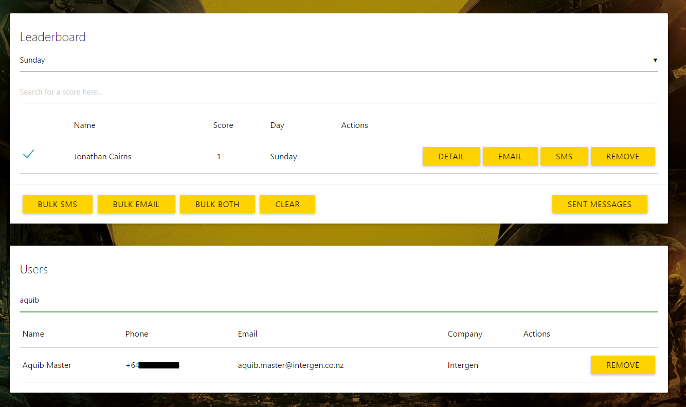

# Intergen Leaderboard

A simple scoreboard application with realtime updates. Initally designed for the Intergen booth at Ignite NZ. Users could sign up and play Halo, their score was reported and displayed on a leaderboard. Administrators could add/remove scores, text/email users who won things.

It's all built with angular/firebase (no backend). Using mandrill for txt/email. 

# development

- get nodejs
- npm install gulp bower -g
- npm install
- bower install
- gulp serve
